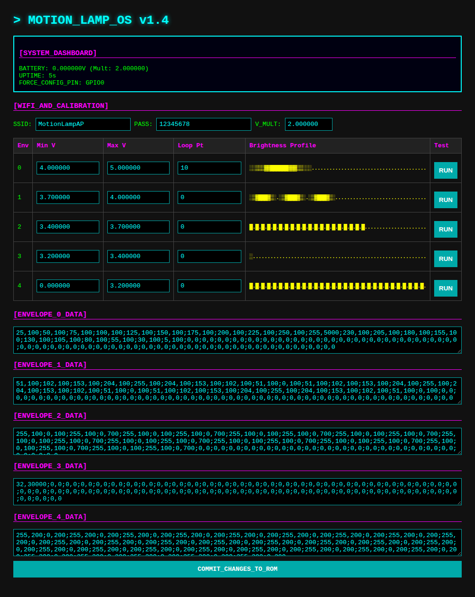

# Motion Activated LED Lamp (ESP8266 & Arduino)

A sophisticated, energy-efficient motion sensor lamp firmware featuring configurable light envelopes, battery monitoring, and a retro-tech web interface.



## Features
- **5 Distinct Light Envelopes**: Fully configurable sequences with 60 steps each (brightness & duration).
- **Adaptive Battery Logic**: Automatically selects light profiles based on lithium-ion battery voltage.
- **Responsive Re-triggering**: Non-blocking state machine with edge-detection allows envelopes to restart at a defined `loopPoint` if motion is detected during execution.
- **Deep Sleep Support**: Maximizes battery life by utilizing low-power modes between events.
- **Motion Lamp OS Web UI**: Technical dashboard for real-time configuration, live visualization of light profiles, and integrated testing.
- **Force-Config Mode**: Dedicated boot-pin trigger for reliable access to configuration settings.

---

## Hardware Setup

### Wiring Diagram (Typical ESP8266)
| Component | Pin | Notes |
| :--- | :--- | :--- |
| PIR Sensor | **D0 (GPIO16)** | Must be connected to **RST** via diode/resistor for wake-up. |
| LED (PWM) | **D1 (GPIO5)** | Use a MOSFET/Transistor for high-power LEDs. |
| Config Button | **D3 (GPIO0)** | Pulls to GND to force config mode. |
| Battery Sense| **A0** | Connected to Li-Ion via 1:1 voltage divider (e.g., 2x 100kΩ). |

### Calibration
Measure your battery voltage with a multimeter and compare it to the `BATTERY_VOLTAGE` on the Dashboard. Adjust the `V_MULT` (Voltage Multiplier) in the web interface until they match.

---

## Usage Instructions

### 1. Initial Configuration
On the first boot, the device will start a WiFi Access Point:
- **SSID**: `MotionLampAP`
- **Password**: `12345678`
- **IP**: `192.168.4.1`

Navigate to `http://192.168.4.1` to access the technical dashboard.

### 2. Entering Configuration Mode
If the device is already configured and in normal operation:
1. Hold the **Config Button** (D3/GPIO0) down.
2. Power on or Reset the device.
3. Keep holding for **5 seconds**.
4. The LED will signal entry, and the Access Point will start.

### 3. Editing Light Envelopes
Envelopes are defined as a series of `brightness,duration(ms)` pairs separated by semicolons.
- **Example**: `255,1000;128,500;0,0` (Bright for 1s, Dim for 0.5s, then End).
- The **Loop Pt** defines which step index to jump to if motion is re-triggered while the lamp is on.

---

## Code Outline

### State Machine Logic
All versions utilize a non-blocking state machine in the `loop()` (or a simulated loop for ESP8266) to handle timing without using `delay()`. This ensures the system remains responsive to the PIR sensor.

```cpp
// Logic Flow:
if (motionDetected) {
    if (currentEnvelope == -1) {
        startNewEnvelope(batteryMapping());
    } else {
        jumpToLoopPoint();
    }
}

if (stepTimeExpired()) {
    executeNextStep();
}

if (envelopeFinished()) {
    goToDeepSleep();
}
```

### Data Structures
- **Step**: Contains `byte brightness` (0-255) and `unsigned int duration` (ms).
- **Envelope**: An array of 60 **Steps** and an `int loopPoint`.
- **PROGMEM**: Used in AVR/Standard versions to store the large envelope arrays in Flash memory instead of SRAM.

---

## Testing
The firmware includes a complete **C++ Mock Environment** in the `tests/` directory. You can verify the logic on a PC using `g++`:
```bash
g++ -Itests tests/Arduino.cpp web_pid_led.cpp tests/test_web_pid.cpp -o test_runner
./test_runner
```
